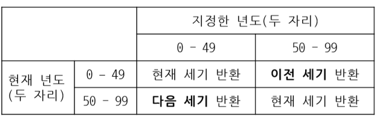

# Single-Row Funtion

단일행 함수

### 문자열 함수

`LENGTH` : 주어진 컬럼 값, 문자열 길이(문자 개수)를 반환하는 함수

- `CHAR 데이터` 타입 컬럼 값을 입력 받은 경우, 실제 데이터 길이(문자 개수)에 상관없이 `컬럼 전체 길이(문자 개수)`를 반환
- `VARCHAR2 데이터` 타입 컬럼 값을 입력 받은 경우 `실제 데이터 길이(문자 개수)` 반환

`INSTR` : 찾는 문자(열)이 지정한 위치부터 지정한 회수만큼 나타난 시작 위치를 반환하는 함수

`LPAD,RPAD` : 주어진 컬럼, 문자열에 임의의 문자(열)을 왼쪽/오른쪽에 `덧붙여 길이 N의 문자열을 반환`하는 함수

`TRIM, LTRIM, RTRIM` : 주어진 컬럼 양쪽/문자열의 왼쪽/오른쪽에서 지정한 `STR에 포함된 모든 문자를 제거한 나머지를 반환`하는 함수

```python
SELECT LTRIM('tech') FROM DUAL;               -->tech 
SELECT LTRIM('tech', '') FROM DUAL;          -->tech 
SELECT LTRIM('000123', '0') FROM DUAL;            -->123 
SELECT LTRIM('123123Tech', '123') FROM DUAL;      -->Tech, 1 or 2 or 3
SELECT LTRIM('123123Tech123', '123') FROM DUAL;   -->Tech123 
SELECT LTRIM('xyxzyyyTech', 'xyz') FROM DUAL;     -->Tech x or y or z
SELECT LTRIM('6372Tech', '0123456789') FROM DUAL; -->Tech
```

```python
SELECT RTRIM('tech') FROM DUAL;                -->tech 
SELECT RTRIM('tech', '') FROM DUAL;           -->tech 
SELECT RTRIM('123000', '0') FROM DUAL;             -->123 
SELECT RTRIM('Tech123123', '123') FROM DUAL;       -->Tech 
SELECT RTRIM('123Tech123', '123') FROM DUAL;       -->123Tech 
SELECT RTRIM('Techxyxzyyy', 'xyz') FROM DUAL;      -->Tech 
SELECT RTRIM('Tech6372', '0123456789') FROM DUAL;  -->Tech
```

```python
SELECT TRIM('tech') FROM DUAL;                -->tech
SELECT TRIM('a' FROM 'aatechaaa') FROM DUAL;       -->tech
SELECT TRIM(LEADING '0' FROM '000123') FROM DUAL;  -->123
SELECT TRIM(TRAILING '1' FROM 'Tech1') FROM DUAL;  -->Tech
SELECT TRIM(BOTH '1' FROM '123Tech111') FROM DUAL; -->23Tech
SELECT TRIM(LEADING FROM 'Tech') FROM DUAL;   -->Tech
```

`SUBSTR` : 주어진 컬럼, 문자열에서 `지정한 위치부터 지정한 개수 만큼의 문자열을 잘라내어` 반환하는 함수

```python
SELECT SUBSTR('Thisisatest', 6, 2) FROM DUAL;  -->is 
SELECT SUBSTR('Thisisatest', 6) FROM DUAL;     -->isatest 
SELECT SUBSTR('이것은연습입니다', 3, 4) FROM DUAL;   -->은연습 
SELECT SUBSTR('TechOnTheNet', 1, 4) FROM DUAL;     -->Tech 
SELECT SUBSTR('TechOnTheNet', -3, 3) FROM DUAL;    -->Net 
SELECT SUBSTR('TechOnTheNet', -6, 3) FROM DUAL;    -->The 
SELECT SUBSTR('TechOnTheNet', -8, 2) FROM DUAL;    -->On
```

`ROUND`: 지정한 자릿수에서 `반올림` 하는 함수

```python
SELECT ROUND(125.315) FROM DUAL;         -->125
SELECT ROUND(125.315, 0) FROM DUAL;      -->125
SELECT ROUND(125.315, 1) FROM DUAL;      -->125.3
SELECT ROUND(125.315, -1) FROM DUAL;     -->130
SELECT ROUND(125.315, 3) FROM DUAL;      -->125.315
SELECT ROUND(-125.315, 2) FROM DUAL;     -->-125.32
```

`TRUNC`: 지정한 자릿수에서 `버림`하는 함수

```python
SELECT TRUNC(125.315) FROM DUAL;         -->125
SELECT TRUNC(125.315, 0) FROM DUAL;      -->125
SELECT TRUNC(125.315, 1) FROM DUAL;      -->125.3
SELECT TRUNC(125.315, -1) FROM DUAL;     -->120
SELECT TRUNC(125.315, 3) FROM DUAL;      -->125.315
SELECT TRUNC(-125.315, -3) FROM DUAL;    -->0
```


### 날짜 함수

`SYSDATE` : 지정된 형식으로 `현재날짜와 시간을 표시`하는 함수

`ADD_MONTHS` : `지정한 만큼의 달 수를 더한` 날짜를 반환하는 함수

`MONTHS_BETWEEN`: `지정한 두 날짜 사이의 월 수`를 반환하는 함수

```python
SELECT MONTHS_BETWEEN ('21/01/19', '21/03/14')FROM DUAL; -->-1.80691009
SELECT MONTHS_BETWEEN ('21/01/19', '20/03/14')FROM DUAL; -->10.19308990
SELECT MONTHS_BETWEEN ('21/01/19', '21/01/19')FROM DUAL; -->0
SELECT MONTHS_BETWEEN ('21/01/19', '20/11/19')FROM DUAL; -->2
```


### 데이터 타입 변환


`TO_CHAR` : `NUMBER/DATE 타입을 CHARACTER 타입으로 변환`하는 함수

```python
SELECT TO_CHAR(1234, '99999') FROM DUAL;    -->1234 
SELECT TO_CHAR(1234, '09999') FROM DUAL;    -->01234, 남는 자리를 0으로 표시
SELECT TO_CHAR(1234, 'L99999') FROM DUAL;   -->￦1234 
SELECT TO_CHAR(1234, '99,999') FROM DUAL;   -->1,234 
SELECT TO_CHAR(1234, '09,999') FROM DUAL;   -->01,234 
SELECT TO_CHAR(1234, '999') FROM DUAL;      -->####, 자릿수가 맞지 않으면 오류
```

```python
SELECT TO_CHAR( SYSDATE, 'PM HH24:MI:SS' ) FROM DUAL;      -->오후 20:57:11
SELECT TO_CHAR( SYSDATE, 'AM HH:MI:SS' ) FROM DUAL;        -->오후 08:57:11
SELECT TO_CHAR( SYSDATE, 'MON DY, YYYY' ) FROM DUAL;       -->1월 화, 2020
SELECT TO_CHAR( SYSDATE, 'YYYY-fmMM-DD DAY' ) FROM DUAL;   -->2021-1-19 화요일
SELECT TO_CHAR( SYSDATE, 'YYYY-MM-fmDD DAY' ) FROM DUAL;   -->2021-01-19 화요일
SELECT TO_CHAR( SYSDATE, 'Year, Q' ) FROM DUAL;            -->Twenty Twenty one, 1, Q는 분기를 나타냄
```

`TO_DATE` : `CHARACTER 타입을 DATE 타입으로 변환`하는 함수

- RR 날짜 형식 : '지정한 년도'와 '현재 년도'에 따라 반환하는 '세기' 값이 달라짐



```python
SELECT TO_DATE( '2021/01/19', 'YYYYMMDD') FROM DUAL;                      -->21/01/19
SELECT TO_CHAR( '20210119', 'YYYY, MON') FROM DUAL;                       -->N/A(오류) 
SELECT TO_CHAR( TO_DATE( '20210119', 'YYYYMMDD'), 'YYYY, MON') FROM DUAL; -->2021, 1월 
SELECT TO_DATE( '210119 143000', 'YYMMDD HH24MISS' ) FROM DUAL;           -->21/01/19 
SELECT TO_DATE( '210119', 'YYMMDD' ) FROM DUAL;                           -->21/01/19
SELECT TO_CHAR( TO_DATE( '980630', 'YYMMDD' ), 'YYYY.MM.DD') FROM DUAL;   -->2098.06.30

```

`TO_NUMBER`: `CHARACTER 타입을 NUMBER 타입으로 변환`하는 함수

### 단일행 기타 함수

`NVL`: `NULL을 지정한 값으로 변환`하는 함수

`DECODE`: `SELECT 구문으로 IF-ELSE 논리를 제한적으로 구현`한 `오라클 DBMS 전용 함수`

`CASE`: DECODE 함수와 유사한 `ANSI 표준 구문`

중첩함수 : 중첩사용 가능

- 가장 안쪽의 함수부터 바깥 쪽 방향으로 차례대로 실행
- 먼저 실행된 함수의 반환 값이 바깥 쪽 함수의 입력 값이 됨 
- 반환되는 함수 결과 데이터 타입에 주의


# GROUP FUNCTION

그룹함수

`AVG` : 입력 값의 `평균을 계산`하여 반환하는 함수

`MIN / MAX` : `최솟 값/ 최대 값`을 반환하는 함수

`COUNT` : `Result Set의 행 수`를 반환하는 함수