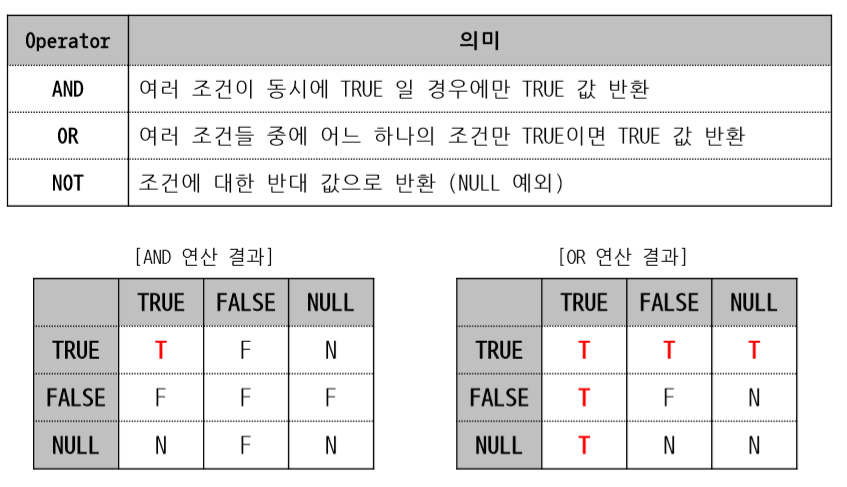

# 연산자

### 연결 연산자 (Concatenation Operator)

- 연결 연산자 `'||'`를 사용하여 여러 컬럼을 하나의 컬럼인 것처럼 연결하거나, 컬럼과 리터럴을 연결할 수 있다.

### 논리 연산자(Logical Operator)

- 여러 개의 제한 조건 결과를 하나의 논리 결과`(TRUE/FALSE/NULL)`로 만들어준다.

### 비교 연산자(Comparison Operator)

-  표현식 사이의 관계를 비교하기 위해 사용한다. 
-  비교 결과는 논리 결과 중의 하나`(TRUE/FALSE/NULL)`가 된다.
-  비교하는 두 컬럼 값/표현식은 서로 동일한 데이터 타입이어야 한다.

- BETWEEN AND : 비교하려는 값이 지정한 범위(상한 값과 하한 값의 경계 포함)에 포함되면 `TRUE`를 반환하는 연산자
- LIKE : 비교하려는 값이 지정한 특정 패턴을 만족시키면 `TRUE`를 반환하는 연산자
  -   `%` : `% `부분에는 임의 문자열(0개 이상의 임의의 문자)이 있다는 의미
  -  ` _` : `_`부분에는 문자 1개만 있다는 의미

### 연산자 우선 순위

-  여러 연산자를 함께 사용할 때 우선 순위를 고려해야 한다.
- `( )`를 사용하면 연산자 우선 순위를 조절할 수 있다.