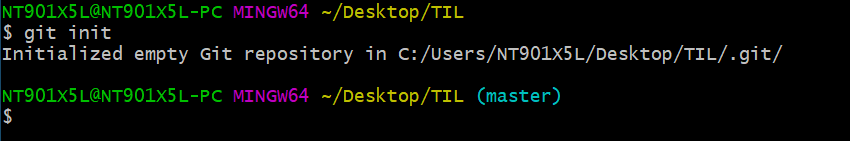

# Git command

> Git 명령어 정리

### 0.1 init

- git init
- .git/ 폴더를 생성해준다.
- 

- .git  폴더가 생성된 경우 오른쪽에 'master' 라는 표시가 나온다.
- 최초에 한번만 하면된다.

 

### 1. add

- 
- working directory => staging area로 이동

 

### 2. config

- git config --lobal user. email "myeail@gmail.com"
  - 이메일의 경우 깃헙에 올릴경우 잔디가 심어지는 기준이므로 정확하게 입력
- git config --global user. name "myname"
- 최초로 한번만 하면 된다.

### 3. commit

- git commit -m "메세지"
- 스냅샷을 찍는 동작
- add 되어있는 퍼일들을 하나의 묶음으로 저장
- 메세지에 들어가는 내용은 기능단위로

### 4.remote

- git remote add origin <주소>
- 원격 저장소와 현재 로컬 장소를 연결

### 5. push

- git push origin master
- 깃아 올려줘 origin master
- 원격 저장소에 로컬 저장소의 데이터를 전송

### 6. status

